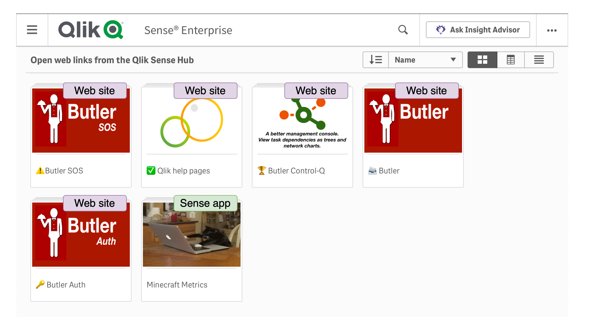
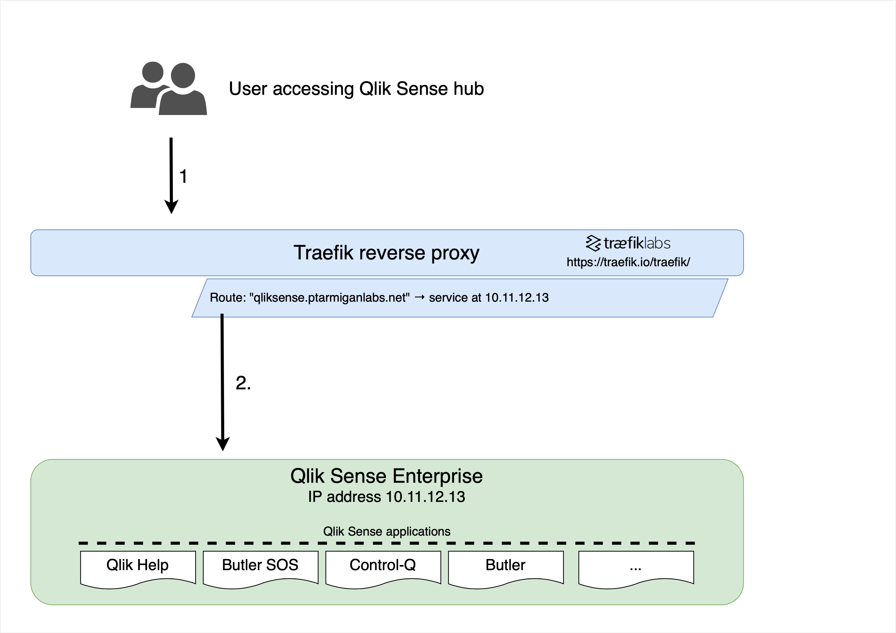
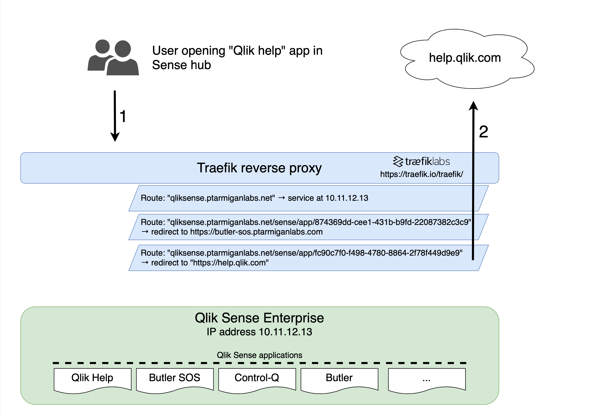

# open-url-from-qlik-sense-hub

## Opening any web page from the Qlik Sense hub

The idea simple:

Use streams in Qlik Sense Enterprise for both Sense apps and links to any web site/URL.  
This way it's possible to gather both Sense apps and links to wikis, documentation, help pages, corporate tools etc within Sense streams.

The Qlik Sense stream might look like this (with some annotations to show what's apps and what's web links):



When a user requests a Sense stream or a Sense app (or any other asset within the Qlik Sense site) Traefik will pass the user's request to the Sense server:



On the other hand, when a user opens a Sense app that in Traefik is associated with a web site, Traefik's routes and middlewares will trigger and redirect the user's request to the web site in question.  
In this case no network traffic what so ever will reach the Sense server.



## Qlik Sense configuration

1. Publish the placeholder app(s) (=the apps that will open web sites when clicked) to the desired stream.
2. Open the placeholder app(s), take note of their respective URLs.

## Traefik reverse proxy

Assuming the file provider is used in Traefik (i.e. Traefik monitoring config files and reading routing config from them), the needed config is something like this:

```yaml
---
http:
  routers:
    # ------------------------------------
    # Qlik Sense Enterprise
    qliksenseProd-http:
      rule: Host(`qliksense.ptarmiganlabs.net`)
      entrypoints: web
      middlewares:
        - qliksense-https-redirect
      service: noop@internal
    qliksenseProd-https:
      rule: Host(`qliksense.ptarmiganlabs.net`)
      entrypoints: websecure
      service: qliksenseProdService
      middlewares:
        - sslHeader
      priority: 1
      # Here we're using https certificates from Let's Encrypt. The details for this are elsewhere in Traefik's config files.
      tls:
        certResolver: myDnsChallengeResolver

    # ------------------------------------
    # Open URLs from Qlik Sense hub
    qs-hub-open-qlikhelp-https:
      rule: Host(`qliksense.ptarmiganlabs.net`) && PathPrefix(`/sense/app/fc90c7f0-f498-4780-8864-2f78f449d9e9`)
      entrypoints:
        - websecure
      middlewares:
        - redirect-qs-hub-open-qlikhelp
      service: noop@internal
      priority: 3
      tls: {}

    qs-hub-open-butlercontrolq-https:
      rule: Host(`qliksense.ptarmiganlabs.net`) && PathPrefix(`/sense/app/7b797bd9-8354-4d00-a4d1-2d50c74c92b3`)
      entrypoints:
        - websecure
      middlewares:
        - redirect-qs-hub-open-butlercontrolq
      service: noop@internal
      priority: 3
      tls: {}

    qs-hub-open-butler-https:
      rule: Host(`qliksense.ptarmiganlabs.net`) && PathPrefix(`/sense/app/b34a8081-ca65-4005-8a93-5daf2d6b7364`)
      entrypoints:
        - websecure
      middlewares:
        - redirect-qs-hub-open-butler
      service: noop@internal
      priority: 3
      tls: {}

    qs-hub-open-butlersos-https:
      rule: Host(`qliksense.ptarmiganlabs.net`) && PathPrefix(`/sense/app/874369dd-cee1-431b-b9fd-22087382c3c9`)
      entrypoints:
        - websecure
      middlewares:
        - redirect-qs-hub-open-butlersos
      service: noop@internal
      priority: 3
      tls: {}

    qs-hub-open-butlerauth-https:
      rule: Host(`qliksense.ptarmiganlabs.net`) && PathPrefix(`/sense/app/9e15c449-6269-4a0b-a51a-afbda794bce2`)
      entrypoints:
        - websecure
      middlewares:
        - redirect-qs-hub-open-butlerauth
      service: noop@internal
      priority: 3
      tls: {}

  middlewares:
    qliksense-https-redirect:
      redirectScheme:
        scheme: https
        permanent: true
    sslHeader:
      headers:
        customRequestHeaders:
          X-Forwarded-Proto: "https"

    # ------------------------------------
    # Traefik middlewares that do the actual re-writing of the incoming URL, effectively redirecting the
    # user's request to specific URLs
    redirect-qs-hub-open-qlikhelp:
      redirectRegex:
        regex: "^https?://qliksense.ptarmiganlabs.net.*"
        replacement: "https://help.qlik.com"
        permanent: true
    redirect-qs-hub-open-butlercontrolq:
      redirectRegex:
        regex: "^https?://qliksense.ptarmiganlabs.net.*"
        replacement: "https://github.com/ptarmiganlabs/butler-control-q-public"
        permanent: true
    redirect-qs-hub-open-butler:
      redirectRegex:
        regex: "^https?://qliksense.ptarmiganlabs.net.*"
        replacement: "https://butler.ptarmiganlabs.com"
        permanent: true
    redirect-qs-hub-open-butlersos:
      redirectRegex:
        regex: "^https?://qliksense.ptarmiganlabs.net.*"
        replacement: "https://butler-sos.ptarmiganlabs.com"
        permanent: true
    redirect-qs-hub-open-butlerauth:
      redirectRegex:
        regex: "^https?://qliksense.ptarmiganlabs.net.*"
        replacement: "https://butler-auth.ptarmiganlabs.com"
        permanent: true

  # Traefik will terminate TLS and forward http to Qlik Sense on port 8088 in this case.
  # Make sure to allow http and set port to 8088 in Sense QMC. 
  # Note: TLS/https configuration of Trafik is not covered in this config file.
  services:
    qliksenseProdService:
      loadBalancer:
        servers:
          - url: 'http://10.11.12.13:8088'
```
